# 📄 Chat with CVs — Enterprise HR RAG Assistant

[](https://python.org)
[](https://streamlit.io)
[](https://azure.microsoft.com/en-us/products/ai-services/ai-search)
[](https://azure.microsoft.com/en-us/products/ai-services/openai-service)
[](https://redis.io)
[](https://www.docker.com/)
[](LICENSE)

An enterprise-grade, high-performance **Retrieval-Augmented Generation (RAG)** application built for HR talent acquisition and technical candidate assessment. 

Powered by **Azure AI Search (Hybrid BM25 + Dense Vector HNSW)**, **FlashRank Cross-Encoder Re-ranking**, **Azure OpenAI GPT-4o**, and an ultra-fast **Two-Tier Redis Semantic Cache**, the system allows recruiters to ingest, search, analyze, and compare candidate resumes with **sub-10ms repeated query latency**, strict factual grounding, and automated hallucination auditing.

---

## 🏗️ System Architecture

```mermaid
flowchart TD
    subgraph Ingestion ["1. Multi-Format Ingestion Pipeline"]
        A["📄 Raw CVs (PDF / DOCX / TXT)"] --> B["⚙️ Multi-threaded Extractor"]
        B --> C["✂️ Section-Aware Chunker"]
        C --> D["🧠 Azure OpenAI (text-embedding-3-small)"]
        D --> E[("🔍 Azure AI Search (Hybrid BM25 + HNSW)")]
        B --> F[("📦 Azure Blob Storage (Archival)")]
    end

    subgraph Query ["2. High-Precision Query & Retrieval Pipeline"]
        Q["👤 Recruiter Query"] --> R{"🔀 Intent Router"}
        R -- "Greetings / Off-Topic" --> R_FAST["⚡ Fast-Path Response (< 1ms)"]
        R -- "CV-Related" --> TIER1{"⚡ Redis Query Vector Cache"}
        TIER1 -- "Hit" --> VEC["🎯 Cached Vector (0.005s)"]
        TIER1 -- "Miss" --> EMB["🧠 Azure OpenAI Embedding"] --> VEC
        VEC --> SEM{"⚡ Redis Semantic Cache (>= 0.92)"}
        SEM -- "Hit" --> HIT_OUT["🚀 Instant Cached Answer (~0.013s)"]
        SEM -- "Miss" --> S1["🔍 Stage 1: Azure AI Search (Hybrid k=20)"]
        S1 --> S2["🎯 Stage 2: FlashRank Re-ranker"]
        S2 --> GATE{"🛡️ Deterministic Role Gate"}
        GATE -- "Role Not Found" --> REFUSAL["🚫 Refusal (Zero Hallucination)"]
        GATE -- "Validated" --> GEN["🤖 Azure OpenAI GPT-4o (Streaming)"]
        GEN --> AUDIT["🛡️ Hallucination Auditor"]
        AUDIT --> FINAL["💬 Recruiter UI (🟢 100% Grounded)"]
        FINAL --> CACHE_SET[("💾 Store in Redis Semantic Cache")]
    end
```



### The End-to-End Pipeline:

1. **Document Ingestion**:
   - Supports **PDF**, **DOCX**, and **TXT** files.
   - Multi-threaded text extraction using `pypdf` and `python-docx`.
   - Raw CV files are archived to **Azure Blob Storage**.

2. **Section-Aware Smart Chunking**:
   - Unlike generic character splitters that cut through job entries, the custom chunker identifies natural CV headings (`Summary`, `Skills`, `Experience`, `Education`, `Projects`, etc.).
   - Prepend structured metadata (`[CV: ...] [Section: Experience]`) to preserve context.

3. **Hybrid Ingestion & Azure AI Search Schema**:
   - Embeds chunks using Azure OpenAI `text-embedding-3-small` (1,536 dimensions).
   - Indexes into an 11-field enriched Azure AI Search index featuring **HNSW Cosine vector search** ($m=4$, $efConstruction=400$, $efSearch=500$) and Azure Semantic Configuration:

| Field Name | Type | Capabilities | Description |
| :--- | :--- | :--- | :--- |
| `id` | `Edm.String` | Key, Filterable | Unique chunk hash (`MD5(file+chunk)`) |
| `cv_id` | `Edm.String` | Filterable, Facetable | Sanitized candidate document identifier |
| `candidate_name` | `Edm.String` | Searchable, Filterable, Facetable | Candidate name extracted from resume |
| `file_name` | `Edm.String` | Searchable, Filterable | Original filename (e.g. `Jane_Doe_CV.pdf`) |
| `section` | `Edm.String` | Searchable, Filterable, Facetable | CV section (`Experience`, `Education`, `Skills`, etc.) |
| `chunk_index` | `Edm.Int32` | Filterable, Sortable | 0-indexed position within resume |
| `content` | `Edm.String` | Searchable | Raw text of chunk (BM25 searchable) |
| `content_vector` | `Collection(Edm.Single)` | Searchable (1,536d) | HNSW Dense Vector (Cosine metric) |
| `uploaded_at` | `Edm.DateTimeOffset` | Filterable, Sortable | Document ingestion timestamp |
| `total_chunks` | `Edm.Int32` | Filterable | Total number of chunks in candidate document |
| `metadata_json` | `Edm.String` | Retrievable | Extended JSON payload (emails, phone, skills) |


4. **Intent & Question Routing**:
   - Fast-path regex filters common greetings and pleasantries in **< 1ms**.
   - Keyword fast-path identifies CV queries instantly with **0ms latency overhead**.
   - Ambiguous queries are classified via a fast LLM gate; off-topic questions bypass search entirely to save compute and API costs.

5. **Two-Stage High-Precision Retrieval**:
   - **Stage 1 (Coarse)**: Azure AI Search hybrid retrieval (BM25 keyword search + HNSW dense vector search) retrieves the top candidate pool.
   - **Stage 2 (Fine)**: Local **FlashRank** cross-encoder model (`ms-marco-TinyBERT`) re-ranks candidate chunks for contextual relevance.

6. **Deterministic Position & Role Validation Gate**:
   - Validates candidate titles against a structured role taxonomy (e.g. recognizing that an *"Agentic AI Developer"* is a specialization under *"AI Developer"*).
   - If a requested position does not exist in the CVs, returns an honest refusal without wasting LLM tokens or guessing.

7. **Hybrid Two-Tier Redis Caching**:
   - **Tier 1 (Exact Query Vector Cache)**: Stores query embeddings in Redis RAM, eliminating the 350ms Azure OpenAI embedding round-trip on repeated queries.
   - **Tier 2 (Semantic Answer & Retrieval Cache)**: Reuses retrieved chunks and generated answers when cosine similarity $\ge 0.92$, achieving **~0.005s – 0.01s** total response times.
   - Automatic fallback to in-memory RAM caching if Redis is offline.

8. **Automated Faithfulness & Hallucination Auditor**:
   - Every generated response is audited claim-by-claim against retrieved CV excerpts.
   - Displays a live grounding badge (e.g. `🟢 100% Grounded`) and flags any ungrounded assertions.

---

## ⚡ Performance Highlights

| Operation | Standard RAG | Chat with CVs (This Project) | Speedup |
| :--- | :--- | :--- | :--- |
| **Repeated Exact Query** | ~4.50s | **0.013s (13 ms)** | **~340x faster** 🚀 |
| **Rephrased Semantic Query** | ~4.50s | **0.35s** (Cache Hit) | **~12x faster** ⚡ |
| **Cold Retrieval + Re-rank** | ~3.00s | **~1.30s** (Hybrid + FlashRank) | **2.3x faster** 🎯 |
| **Off-Topic / Greeting Query** | ~4.50s | **0.001s** (Router Fast-Path) | **Instant Bypass** 🛡️ |

---

## 🖥️ Streamlit Interface & Recruiter Experience

The interactive web UI provides talent acquisition teams with full transparency and granular control:

* **📁 Multi-File CV Ingestion**: Drag-and-drop multiple candidate resumes simultaneously (PDF, DOCX, TXT) with live progress tracking and automated indexing.
* **🎛️ Dynamic Sidebar Controls**:
  - **Candidate Depth ($k$)**: Adjust the number of chunks retrieved per query ($1$ to $20$).
  - **FlashRank Re-ranking**: Toggle cross-encoder re-ranking on/off to compare raw vs re-ranked results.
  - **Semantic Caching**: Enable/disable caching and tune the cosine similarity threshold ($\ge 0.92$).
  - **Hallucination Auditor**: Toggle real-time fact-checking and grounding badges.
* **⏱️ Real-Time Latency Breakdown**: Displays precise timing diagnostics for each interaction:
  - Retrieval time (e.g., `0.005s` with cache vs `1.39s` cold)
  - Re-ranking time
  - Generation time
  - Cache status badge (`⚡ Cache HIT` / `🔄 Cache MISS`)
* **🔍 Context Attribution & Sources**: Expandable candidate cards displaying exact matching CV excerpts, candidate names, section headings, and re-ranker confidence scores.
* **🛡️ Factuality Badges**: Live claim-by-claim verification display (e.g., `🟢 100% Grounded`) ensuring zero hallucinated candidate credentials.

---

## 🛠️ Tech Stack

* **Frontend**: [Streamlit](https://streamlit.io/)
* **Cloud Search & Storage**: [Azure AI Search](https://azure.microsoft.com/en-us/products/ai-services/ai-search), [Azure Blob Storage](https://azure.microsoft.com/en-us/products/storage/blobs)
* **LLM & Embeddings**: [Azure OpenAI](https://azure.microsoft.com/en-us/products/ai-services/openai-service) (`gpt-4o-mini` / `gpt-4o`, `text-embedding-3-small`)
* **Re-ranking**: [FlashRank](https://github.com/PrithivirajDamodaran/FlashRank) (Local ONNX Cross-Encoder)
* **Caching**: [Redis 7](https://redis.io/) + [NumPy](https://numpy.org/) Vector Cosine Similarity
* **Document Parsing**: `pypdf`, `python-docx`
* **Containerization**: Docker, Docker Compose

---

## 📂 Project Structure

```text
chat-with-cvs/
├── app.py                      # Main Streamlit Web Application
├── config.py                   # Central environment & hyperparameter configuration
├── clients.py                  # Azure & OpenAI client singletons
├── cache_manager.py            # Redis & in-memory Hybrid Semantic Caching
├── docker-compose.yml          # Docker Compose (Redis + Streamlit App)
├── Dockerfile                  # Production container definition
├── requirements.txt            # Python dependencies
│
├── ingestion/                  # Document Processing & Indexing
│   ├── extractor.py            # PDF / DOCX / TXT text extraction
│   ├── chunker.py              # Section-aware structural CV chunking
│   ├── embeddings.py           # Azure OpenAI vector generation
│   ├── indexer.py              # Azure AI Search HNSW index management
│   ├── storage.py              # Azure Blob Storage archival
│   └── pipeline.py             # Multi-threaded parallel ingestion coordinator
│
├── retrieval/                  # Search & Re-ranking Pipeline
│   ├── searcher.py             # Two-stage retrieval + query vector caching
│   └── reranker.py             # FlashRank cross-encoder re-ranking
│
├── generation/                 # LLM Answering & Quality Gates
│   ├── generator.py            # Streaming response generator with answer cache
│   ├── prompts.py              # HR system prompts & context formatting
│   ├── role_matcher.py         # Deterministic job title & taxonomy validation
│   ├── router.py               # Question routing (CV_RELATED vs NOT_CV_RELATED)
│   └── evaluator.py            # Hallucination and faithfulness auditor
│
├── data/                       # Sample candidate CVs for testing
└── tests/                      # Verification and benchmark test suite
    ├── test_extraction.py      # Tests PDF/DOCX section parsing
    ├── test_retrieval.py       # Interactive CLI search test
    ├── test_semantic_cache.py  # Verifies Redis cosine similarity math
    ├── test_reranker.py        # Validates FlashRank scoring
    └── test_hallucination.py   # Tests faithfulness auditor
```

---

## 🚀 Getting Started

### 1. Prerequisites
* Python 3.11 or 3.12 (or Conda)
* [Docker Desktop](https://www.docker.com/products/docker-desktop/) (for Redis caching)
* An active Microsoft Azure Subscription with:
  * Azure OpenAI resource (Deployments: `gpt-4o-mini` and `text-embedding-3-small`)
  * Azure AI Search resource
  * Azure Storage Account (Blob Storage)

### 2. Clone and Setup Environment

```bash
git clone <your-repo-url>
cd chat-with-cvs
```

Create and activate a virtual environment:
```bash
# Using venv:
python -m venv .venv
source .venv/bin/activate  # On Windows: .venv\Scripts\activate

# Or using Conda:
conda create -n envo python=3.12 -y
conda activate envo
```

Install dependencies:
```bash
pip install -r requirements.txt
```

### 3. Configure Environment Variables

Create a `.env` file in the project root:

```env
# Azure OpenAI
AOAI_ENDPOINT=https://<your-resource-name>.openai.azure.com/
AOAI_API_KEY=<your-azure-openai-key>
AOAI_API_VERSION=2024-02-01
CHAT_MODEL=gpt-4o-mini
EMBED_MODEL=text-embedding-3-small
EMBED_DIM=1536
EMBED_BATCH_SIZE=16

# Azure AI Search
SEARCH_ENDPOINT=https://<your-search-name>.search.windows.net
SEARCH_KEY=<your-azure-search-admin-key>
INDEX_NAME=cv-index

# Azure Blob Storage
STORAGE_CONNECTION_STRING=<your-storage-connection-string>
CONTAINER=cv-resumes

# Redis Cache
REDIS_URL=redis://localhost:6379/0
REDIS_ENABLED=true
REDIS_CACHE_TTL=3600
SEMANTIC_CACHE_ENABLED=true
SEMANTIC_CACHE_THRESHOLD=0.92

# Re-ranker
RERANKER_ENABLED=true
RERANK_TOP_N=20
```

---

## 🏃 Running the Application

### Option A: Running with Docker Compose (Recommended)

Spins up both the Redis cache container and the Streamlit app:

```bash
docker-compose up --build
```
Access the application at `http://localhost:8501`.

---

### Option B: Running Locally

1. **Start Redis** (via Docker or local Redis service):
   ```bash
   docker-compose up -d redis
   ```
2. **Launch Streamlit**:
   ```bash
   streamlit run app.py
   ```
3. Open your browser at `http://localhost:8501`.

---

## 🧪 Testing & Verification

Run individual test suites from the `tests/` directory:

```bash
# 1. Test CV Text Extraction & Section Chunking
python tests/test_extraction.py data/Basel_Barakat_CV.pdf

# 2. Interactive Search & Azure AI Search CLI
python tests/test_retrieval.py

# 3. Benchmark FlashRank Re-ranker
python tests/test_reranker.py

# 4. Verify Redis Semantic Caching & Cosine Math
python tests/test_semantic_cache.py

# 5. Live Semantic Cache Hit Demo (Sub-10ms Benchmark)
python tests/demo_semantic_hit.py

# 6. Test Hallucination & Grounding Auditor
python tests/test_hallucination.py
```

---

## 🔒 Security & Best Practices

* **No Hardcoded Secrets**: All keys, endpoints, and credentials are managed through environment variables (`.env`).
* **Strict Factuality**: Zero temperature (`temperature=0.0`) combined with candidate attribution principles prevents generative hallucinations.
* **Resilient Caching**: Automatic fallback to in-memory caching ensures uninterrupted service if Redis is temporarily unreachable.
* **Cache Invalidation**: Re-uploading or processing new CVs automatically flushes stale answer and retrieval caches.

---

## 📄 License
This project is licensed under the MIT License.
